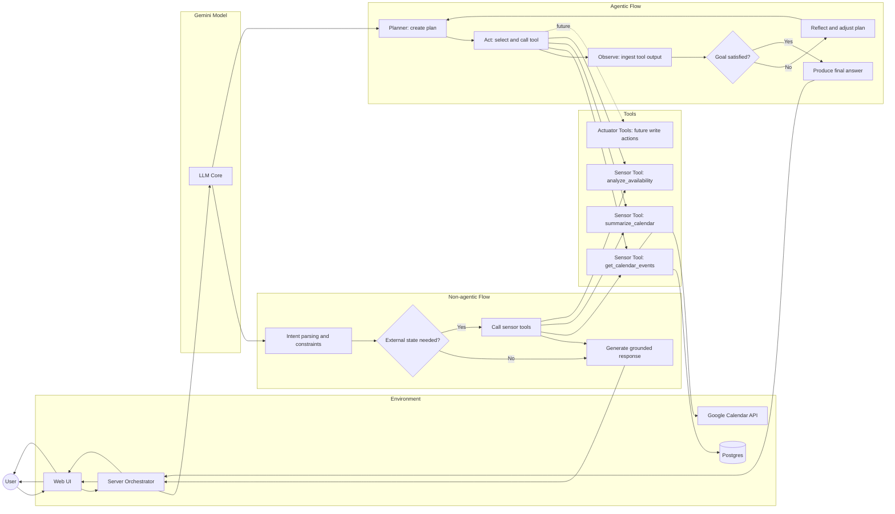

### Agent Flows

```mermaid
flowchart LR
    User((User))

    subgraph ENV[Environment]
        UI[Web UI]
        Orch[Server Orchestrator]
        Store[(Postgres)]
        GCal[Google Calendar API]
    end

    subgraph TOOLS[Tools]
        S1[Sensor Tool: get_calendar_events]
        S2[Sensor Tool: summarize_calendar]
        S3[Sensor Tool: analyze_availability]
        A1[Actuator Tools: future write actions]
    end

    subgraph LLM[Gemini Model]
        M[LLM Core]
    end

    %% Non-agentic workflow
    subgraph WF[Non-agentic Flow]
        WF1[Intent parsing and constraints]
        WF2{External state needed?}
        WF3[Call sensor tools]
        WF4[Generate grounded response]
    end

    %% Agentic loop
    subgraph AG[Agentic Flow]
        AG1[Planner: create plan]
        AG2[Act: select and call tool]
        AG3[Observe: ingest tool output]
        AG4{Goal satisfied?}
        AG5[Reflect and adjust plan]
        AG6[Produce final answer]
    end

    %% Entry
    User --> UI --> Orch --> M

    %% Workflow edges
    M --> WF1 --> WF2
    WF2 -- No --> WF4
    WF2 -- Yes --> WF3 --> WF4
    WF4 --> Orch --> UI --> User

    %% Agentic edges
    M --> AG1 --> AG2 --> AG3 --> AG4
    AG4 -- No --> AG5 --> AG1
    AG4 -- Yes --> AG6 --> Orch --> UI --> User

    %% Tool wiring
    WF3 --> S1
    WF3 --> S2
    WF3 --> S3

    AG2 --> S1
    AG2 --> S2
    AG2 --> S3
    AG2 -. future .-> A1

    %% Environment wiring
    S1 --> Store
    S1 --> GCal
```
