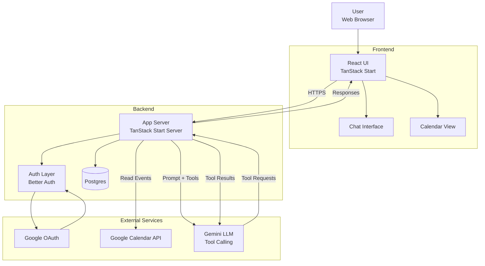

### App Architecture

```mermaid
graph TD
    User[User<br/>Web Browser]

    subgraph Frontend
        UI[React UI<br/>TanStack Start]
        ChatUI[Chat Interface]
        CalendarUI[Calendar View]
    end

    subgraph Backend
        API[App Server<br/>TanStack Start Server]
        Auth[Auth Layer<br/>Better Auth]
        DB[(Postgres)]
    end

    subgraph External Services
        GoogleOAuth[Google OAuth]
        GoogleCalendar[Google Calendar API]
        Gemini[Gemini LLM<br/>Tool Calling]
    end

    User --> UI
    UI --> ChatUI
    UI --> CalendarUI

    UI -->|HTTPS| API

    API --> Auth
    Auth --> GoogleOAuth
    GoogleOAuth --> Auth

    API --> DB

    API -->|Read Events| GoogleCalendar

    API -->|Prompt + Tools| Gemini
    Gemini -->|Tool Requests| API
    API -->|Tool Results| Gemini

    API -->|Responses| UI
```

